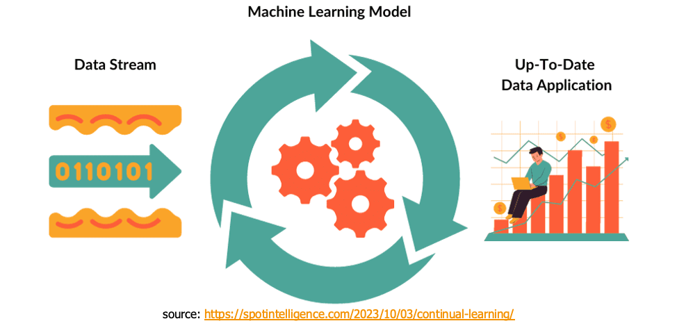
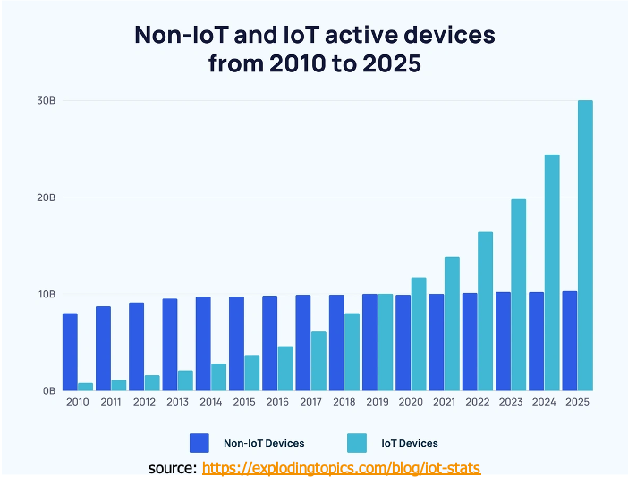
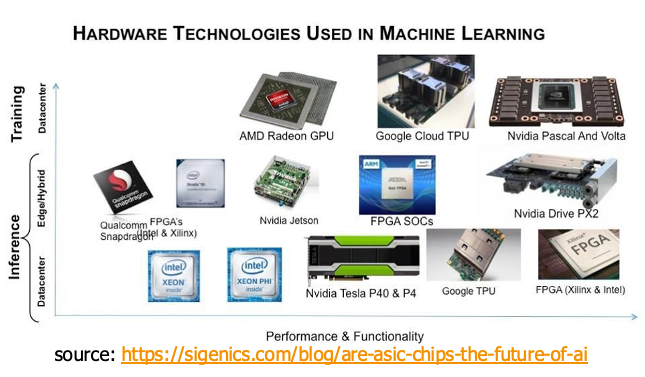
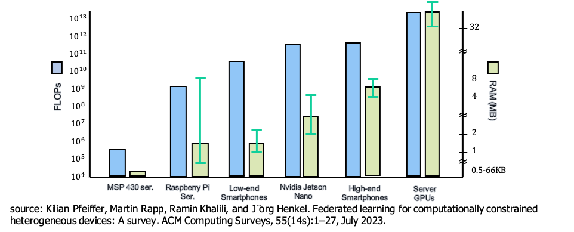
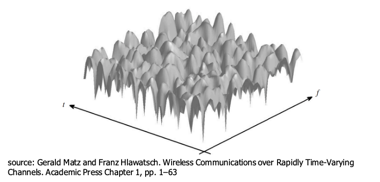
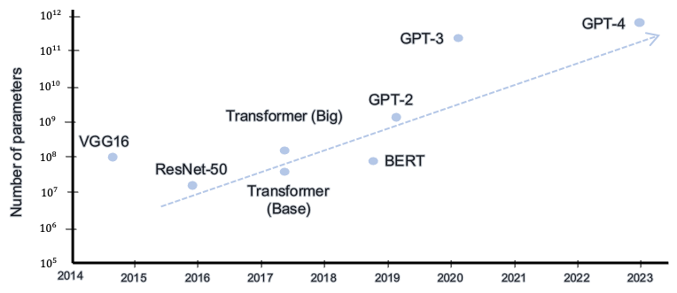
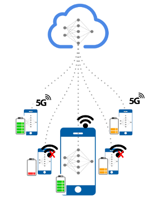

## Federated Learning
Federated learning (FL) is a distributed machine learning paradigm in which multiple decentralized entities (clients)—such as edge devices, institutions, or data silos—collaboratively train a shared global model under centralized orchestration, without transferring raw data. This framework employs iterative rounds of local computation (e.g., stochastic gradient descent on client-specific datasets) followed by aggregation of model updates (e.g., gradients, weights) at the central server.
By decoupling model training from direct data access, FL inherently addresses data sovereignty, privacy preservation, and communication efficiency, while mitigating risks of data leakage. [1]

- FL: Establishing a model exploiting a vast amount of data preserving the privacy
    - Data is stored at local users
    - Local users transmit model parameters instead of raw data
- FL Applications [2]
    - (Cross-device FL) Smart phones: next-word prediction [3], face detection, and voice recognition [4]
    - (Cross-silo FL) Hospitals: strict privacy practices [5]

## Edge Devices
- Growing amount of edge devices
- A vast amount of data from edge devices
- Necessity of *Federated learning for on-device AI*

## System Heterogeneity
- Computing power
    - Hardware
        - CPU / GPU / NPU / FPGA / ASIC 
    - Run-time dynamics
- Communications
    - 3G/4G/5G/Wi-Fi
- Memory, battery, cloud-aided / on-device AI …

## Challenges of FL in this Era
- Increasing model size + more heterogeneous devices
- **FL must tolerate heterogeneous systems**

---
[1] Peter Kairouz et al., Advances and Open Problems in Federated Learning, 2021.

[2] T. Li, A. K. Sahu, A. Talwalkar and V. Smith, "Federated Learning: Challenges, Methods, and Future Directions," IEEE Signal Processing Magazine, vol. 37, no. 3, pp. 50-60, May 2020.

[3] https://support.google.com/gboard/answer/12373137?hl=en & Hard, Andrew, et al. "Federated learning for mobile keyboard prediction." arXiv preprint arXiv:1811.03604 (2018).

[4] https://support.google.com/assistant/answer/10176224?hl=en

[5] Dou, Q., So, T.Y., Jiang, M. et al. Federated deep learning for detecting COVID-19 lung abnormalities in CT: a privacy-preserving multinational validation study. npj Digit. Med. 4, 60 (2021).

